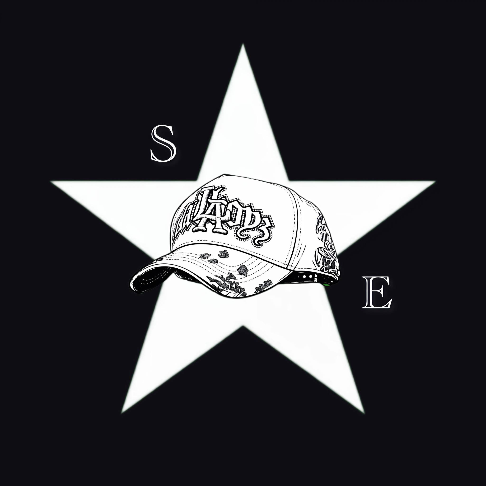

<p align="center">
  
</p>

<h1 align="center">Salva Exclusive Caps</h1>

<p align="center">
  Gorras exclusivas con imagen premium, atención directa y visión de crecimiento.
</p>

<p align="center">
  
  
  
  
  
</p>

<p align="center">
  <a href="#overview">Overview</a> •
  <a href="#objectives">Objectives</a> •
  <a href="#main-sections">Sections</a> •
  <a href="#tech-stack">Tech Stack</a> •
  <a href="#getting-started">Getting Started</a> •
  <a href="#internal-documentation">Docs</a> •
  <a href="#roadmap">Roadmap</a>
</p>

---

## Overview

Este repositorio contiene la página web principal de **Salva Exclusive Caps**, una marca enfocada en la venta de gorras exclusivas con una presencia digital seria, estética premium y base técnica lista para escalar.

La web está pensada para:

- presentar la marca con una identidad sólida
- mostrar catálogo de productos
- facilitar contacto comercial
- elevar confianza digital
- servir como base para mejoras futuras de operación, analítica e inventario

---

## Objectives

- presentar la marca con imagen premium
- mostrar catálogo de forma clara
- facilitar contacto por WhatsApp y redes sociales
- mejorar confianza comercial
- preparar el proyecto para futuras integraciones técnicas y operativas

---

## Main Sections

La web contempla módulos públicos como:

- **Inicio**
- **Catálogo**
- **Producto individual**
- **Nosotros**
- **Contacto**
- **FAQ**
- **Disponibilidad y envíos**

---

## Tech Stack

- **Next.js**
- **React**
- **TypeScript**
- **GitHub**
- **Vercel**

---

## Project Structure

```txt
.
├── public/              # imágenes y assets públicos
├── src/
│   ├── app/             # páginas y rutas
│   └── components/      # componentes reutilizables
├── docs/                # documentación interna del proyecto
├── package.json
├── package-lock.json
└── README.md
